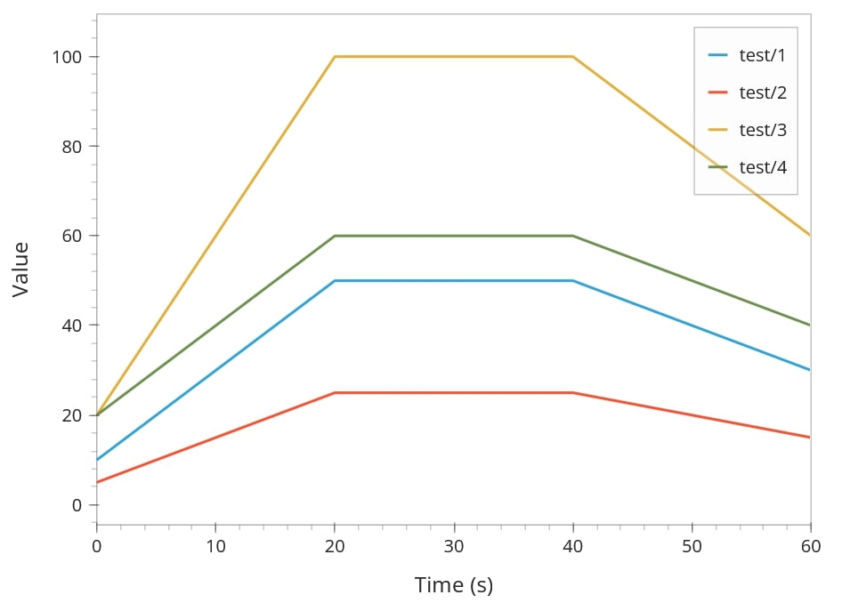
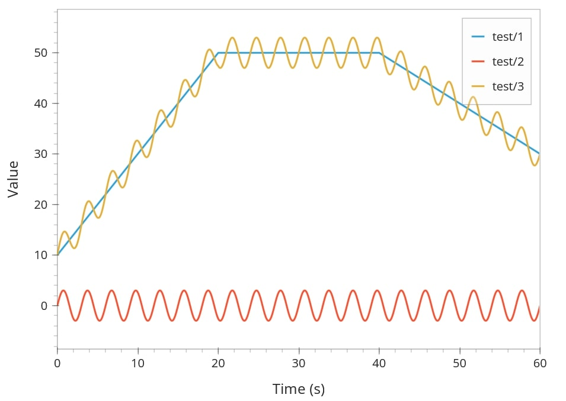
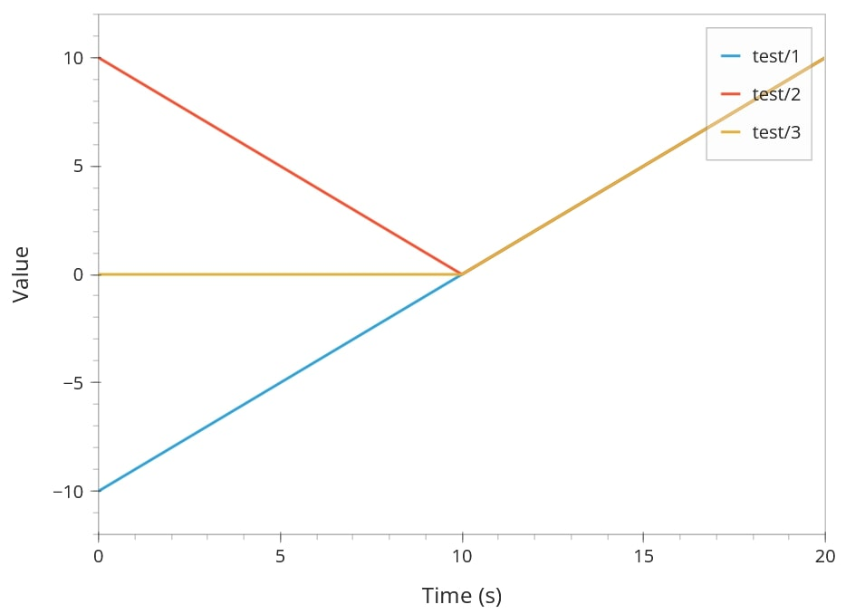
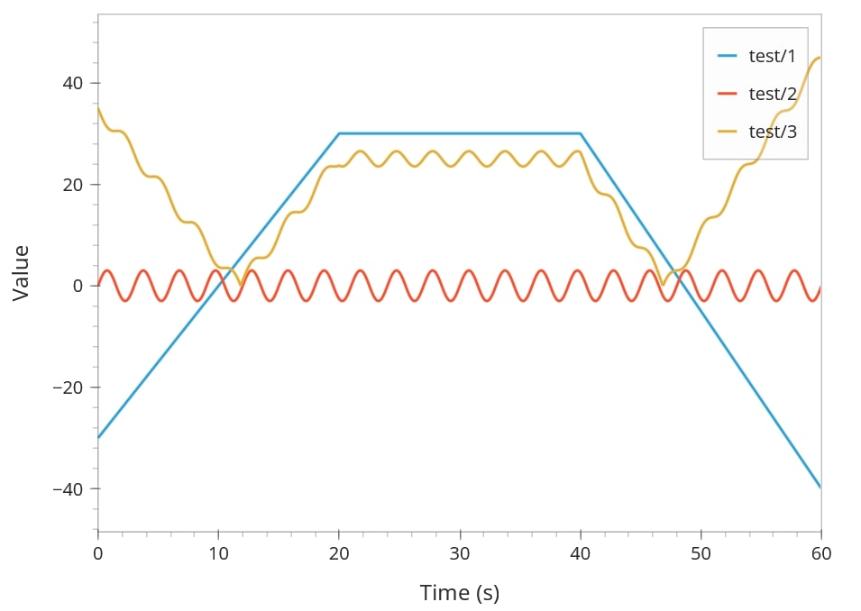

.. _derived-waveforms:

=================
Derived Waveforms
=================

Derived waveforms are waveforms whose values are computed from other waveforms.
These computations may involve mathematical expressions or NumPy functions.
Whenever a source waveform is changed, any waveform that depends on it is automatically 
recalculated in the GUI.

Examples
========

Arithmetic on a Single Waveform
-------------------------------

This example shows how you can do arithmetic on a waveform.
``test/2`` divides waveform ``test/1`` by 2, ``test/3`` multiplies it by 2, 
and ``test/4`` adds a constant offset.

.. code-block:: yaml

    example:
      test/1:
      - {type: linear, from: 10, to: 50, duration: 20}
      - {type: constant, value: 50, duration: 20}
      - {type: linear, from: 50, to: 30, duration: 20}
      test/2: |
        'test/1' / 2
      test/3: |
        2 * 'test/1'
      test/4: |
        'test/1' + 10

.. note::

    If you are using the Waveform Editor from the GUI, you only have to enter the 
    expression in the block string. For the example above, you would only need
    to enter ``'test/1' + 10`` as the waveform definition.

Multiple Dependencies
---------------------

It is allowed to use multiple different dependent waveforms in an expression. 
In the example below, waveform ``test/3`` is the sum of the waveforms ``test/1`` and ``test/2``.

.. code-block:: yaml

    example:
      test/1:
      - {type: linear, from: 10, to: 50, duration: 20}
      - {type: constant, value: 50, duration: 20}
      - {type: linear, from: 50, to: 30, duration: 20}
      test/2:
      - {type: sine, amplitude: 3, period: 3, duration: 60}
      test/3: |
        'test/1' + 'test/2'

Using NumPy Functions
---------------------

It is allowed to use NumPy expressions to transform existing waveforms. 
This example demonstrates using different NumPy functions in derived waveform expressions.
``test/2`` applies the absolute value, and ``test/3`` clamps the waveform to non-negative values using ``np.maximum``.

.. code-block:: yaml

    example:
      test/1:
      - {type: linear, from: -10, to: 10, duration: 20}
      test/2: |
        np.abs('test/1')
      test/3: |
        np.maximum('test/1', 0)

Combined Operations
-------------------

All methods explained above may be combined to generate complex waveform definitions, 
an example of this is shown below.

.. code-block:: yaml

    example:
      test/1:
      - {from: -30, to: 30, duration: 20}
      - {duration: 20}
      - {to: -40, duration: 20}
      test/2:
      - {type: sine, amplitude: 3, period: 3, duration: 60}
      test/3: |
        np.abs('test/1' - 5 + 'test/2' / 2)

