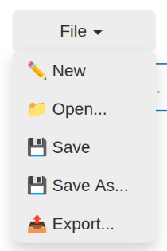
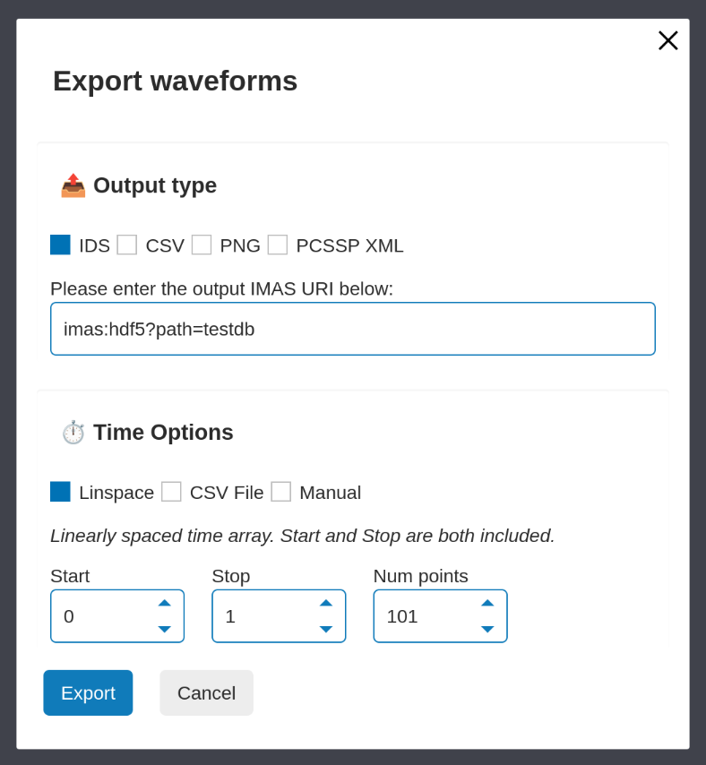
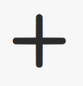
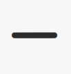
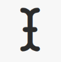
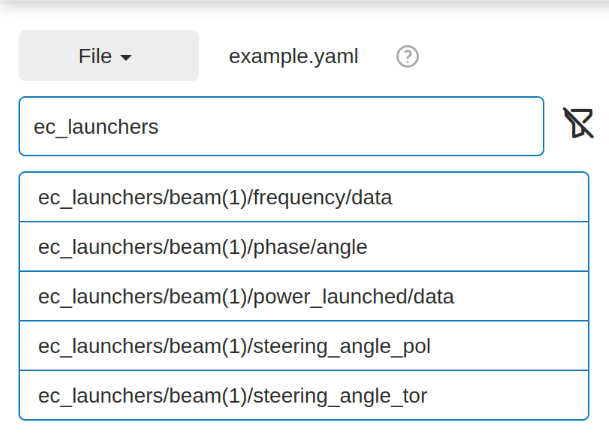
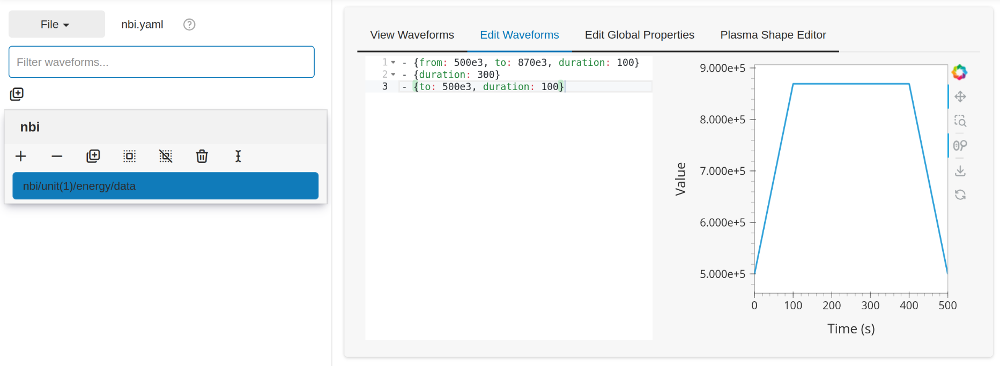
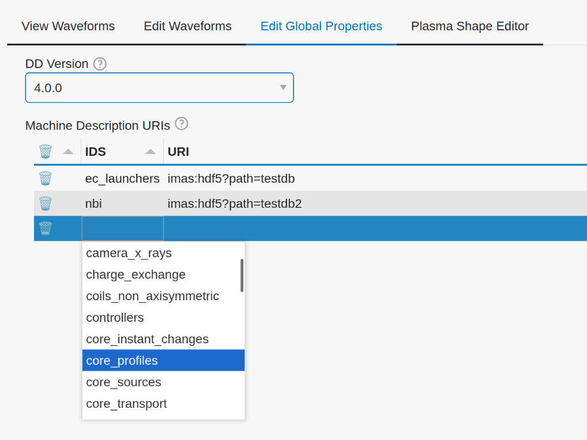

.. _gui:

========================
Graphical User Interface
========================

The Waveform Editor provides a Graphical User Interface (GUI), with which you can:

* Create, load, edit, and save waveform configurations from YAML files.
* View plots of one or multiple waveforms simultaneously for comparison.
* Edit waveforms through a text editor with live plot updates and error
  highlighting.
* Export waveform data to various formats, including IDS, CSV, PNG, and PCSSP XML.
* Graphically edit and design the desired plasma shape using NICE.

Launching the GUI
-----------------

The GUI can be launched using the following command in your terminal:

.. code-block:: bash

    waveform-editor gui

You can also optionally specify a YAML file to load on startup:

.. code-block:: bash

    waveform-editor gui /path/to/your/waveforms.yaml

.. note::

  This normally opens automatically in your default web browser. If it does not, 
  you can manually open the app in a web browser by going to the address printed in the terminal.
  For example, when the ``waveform-editor gui`` command has the following output, the app is running
  on the web address ``http://localhost:38895``.

  .. code-block:: console

      $ waveform-editor gui
      [...]
      Launching server at http://localhost:38895

File Handling
-------------

All file operations are managed through the **File** menu located at the top of the
sidebar. This menu allows you to create, open, save, and export waveform
configurations. The name of the currently open file is displayed next to the menu.
An asterisk (``*``) next to the filename indicates that there are unsaved changes.

   File Menu Interface

Opening a Configuration file
^^^^^^^^^^^^^^^^^^^^^^^^^^^^

You can start a new configuration or open an existing one from the sidebar's
**File** menu.

* To start a new, empty waveform configuration, click **File > ✏️ New**. 

* To load an existing waveform configuration from a YAML file, click
  **File > 📁 Open...**. This will open a file dialog where you can navigate to and
  select your ``.yaml`` file.

Saving a Configuration
^^^^^^^^^^^^^^^^^^^^^^

You can save your work in two ways:

* **File > 💾 Save**: This option saves the current configuration to the currently
  open file. If you are working on a new, untitled configuration, it will trigger
  the "Save As" dialog instead.
* **File > 💾 Save As...**: This opens a file dialog, allowing you to save the
  current configuration to a new file or overwrite an existing one.

Exporting a Configuration
^^^^^^^^^^^^^^^^^^^^^^^^^

To export the waveform data, click **File > 📤 Export...**. This opens the export
dialog, which provides several options:

1.  **Output type**: Choose the desired format for the export.

    * **IDS**: Exports the data to an IMAS database entry. You must provide a valid
      IMAS URI.
    * **CSV**: Exports all waveforms into a single CSV file, with a time column
      and a column for each waveform. You must provide a valid output file path.
    * **PNG**: Exports a plot of each waveform as a separate PNG image file. You
      must provide a path to an output directory.
    * **PCSSP XML**: Exports the data into the PCSSP XML format.

2.  **Time Options**: Define the time points at which the waveforms will be
    evaluated. This is required for all export types except PNG with the "Default"
    option.

    * **Default** (only when exporting to PNG): Each waveform is plotted using its own automatically
      determined time array.
    * **Linspace**: Creates a linearly spaced time array from a **Start** time,
      **Stop** time, and the **Number of points**.
    * **CSV File**: Upload a CSV file containing a single row of comma-separated
      time values.
    * **Manual**: Manually enter a comma-separated list of time values (e.g.
      ``0, 0.5, 1.0``).

   The export dialog

Editing Configuration
---------------------

The main interface is divided into a sidebar for selection and a tabbed area for
viewing and editing. The workflow involves selecting waveforms in the sidebar and
then using the tabs to view or modify them.

Waveform Selection Options
^^^^^^^^^^^^^^^^^^^^^^^^^^

The waveforms in the configuration are organized into hierarchical structure of groups,
For more details on the file format, see the :ref:`YAML File Format <yaml_format>` section.
This structure is visualized in the sidebar of the GUI.

For each group, a row of buttons provides several actions:

* |add_waveform_icon| **(Add new waveform)**: Creates a new, empty waveform within that group.
* |remove_waveform_icon| **(Remove selected waveforms)**: Deletes all selected waveforms within that
  group.
* |add_group_icon| **(Add new group)**: Creates a new subgroup.
* |select_all_icon| **(Select all)**: Selects all waveforms in the group (only available in the
  "View Waveforms" tab).
* |deselect_all_icon| **(Deselect all)**: Deselects all waveforms in the group.
* |remove_group_icon| **(Remove this group)**: Deletes the group and all its contents (waveforms and
  subgroups).
* |rename_waveform_icon| **(Rename waveform)**: Renames the single selected waveform in that group.

Filtering Waveforms
^^^^^^^^^^^^^^^^^^^

To quickly find specific waveforms in large configurations, a filter bar is
available at the top of the waveform selector sidebar.

As you type into the "Filter waveforms..." box, the waveforms will be filtered based on 
whether the names contain the typed text. The search is case-insensitive.

To return to the tree view, you can either clear the text from the filter bar
manually or click the **Clear filter** (|clear_filter_icon|) icon that appears next to it.

   Filtering waveforms containing ``ec_launchers`` 
   for :ref:`this example configuration <example_config>`

Viewing and Editing Waveforms
^^^^^^^^^^^^^^^^^^^^^^^^^^^^^

The GUI provides two main tabs for working with waveforms: **View Waveforms**, and **Edit Waveforms**.

The **View Waveforms** tab allows you to plot multiple waveforms on the same axes
for comparison. In this mode, you can select multiple waveforms from the sidebar, 
and they will be displayed in the plot on the right.

The **Edit Waveforms** tab is designed for modifying a single, selected waveform.
This view is split into two sections:

* **Code Editor**: The YAML definition for the selected waveform is displayed here.
  You can directly edit the text, and the plot will update automatically. If
  there are syntax errors or inconsistencies in the waveform logic, an error or
  warning message will appear below the editor, and annotations will highlight
  the problematic lines.

   Example of an nbi waveform, showing the code editor containing the waveform YAML defition, 
   and the plot showing the waveform currently being editted.

* **Interactive Plot**: For waveforms with ``piecewise`` tendencies, the waveform can be
  updated by interacting with the plot. All changes are instantly reflected in the YAML code. 
  To interact with the plot, ensure you enable the **Point Draw Tool** (|point_draw_tool|). 
  You can:

  * **Add Points**: Click anywhere on the plot to add a new point. Note: it is not 
    possible to interactively add points before a piecewise tendency, or between two
    different piecewise tendencies.
  * **Move Points**: Select one or more point and drag to change their time and
    value.
  * **Remove Points**: Select one or more points and press **Backspace**.

Editing Global Properties
^^^^^^^^^^^^^^^^^^^^^^^^^

The **Edit Global Properties** tab allows you to configure settings that apply to
the entire configuration. Changing these updates the global properties
of the configuration. Information about the avilable properties can be found in the 
:ref:`Global properties <global_properties>` section.

   Example showing how to set the global properties

Plasma Shape Editor
-------------------

TODO: The plasma shape editor is currently still under development. The
documentation will be updated once it is in a more finished state.

p' and ff' Parameterizations
^^^^^^^^^^^^^^^^^^^^^^^^^^^^^

NICE can use a simplified parameterization for the p' and ff' profiles. These can be 
used by selecting the `Manual` mode in the `Plasma Properties` options menu of the Plasma Shape Editor.
The following parameterizations are used:

.. math::

   \begin{aligned}
   p'(\psi_N) &\propto \frac{\beta}{r_0} \big(1 - \psi_N^\alpha\big)^\gamma \\
   ff'(\psi_N) &\propto (1 - \beta) \mu_0 r_0 \big(1 - \psi_N^\alpha\big)^\gamma
   \end{aligned}

Here, :math:`\psi_N` is the normalized poloidal magnetic flux, :math:`r_0` is the major 
radius of the vacuum chamber, and :math:`\mu_0` is constant magnetic permeability of vacuum.
Note, the actual p' and ff' will be scaled by NICE to satisfy the required total plasma current Ip.

The parameter **beta** is related to the poloidal beta, whereas **alpha** and **gamma** describe the peakage of the current profile. See equation 2.11 in `B. Cédric, et al. "CÉDRÈS: a free-boundary solver 
for the Grad–Shafranov equation." (2014) <https://inria.hal.science/hal-01088772/file/CedresRefPaper.pdf>`_
