.. _available-tendencies:

=====================
Available Tendencies
=====================

This document describes the different types of tendencies available in the Waveform Editor and the parameters you can set for each in the YAML configuration.

Each tendency defines the behavior of the signal over a specific time interval. You can chain multiple tendencies together to create complex waveforms.

If ``type`` is omitted it is inferred from the entry's keys: ``ref`` → :ref:`import <import-tendency>`, ``to`` → linear, ``time`` → :ref:`piecewise <piecewise-linear-tendency>`, ``value`` → constant; anything else defaults to ``linear`` (so a ``from``-only, ``rate``-only, or bare segment is still a linear ramp). Tendencies with no distinguishing key -- the periodic shapes, ``smooth``, and a value-less ``constant`` -- must name their ``type`` explicitly.

Common Time Parameters
======================

Most tendencies accept the following parameters to define their time interval. You can provide the following three parameters. If only two are provided, the third is calculated automatically (``start + duration = end``). If all three are provided, they must be consistent.

*   ``start``: The absolute time at which the tendency begins. If omitted, it defaults to the ``end`` time of the previous tendency, or 0 if it's the first tendency.
*   ``duration``: The length of time the tendency lasts. If omitted, it defaults to 1.0 second (unless ``start`` and ``end`` are given). Must be positive.
*   ``end``: The absolute time at which the tendency ends. If omitted, it's calculated from ``start + duration``.

.. note::
    The :ref:`Piecewise Linear Tendency <piecewise-linear-tendency>` is an exception and derives its time interval solely from its ``time`` parameter list. It does *not* accept ``start``, ``duration``, or ``end``.

Constant Tendency
=================

Represents a constant value over the specified time interval.

Parameters
----------
*   ``value``: The constant value the signal holds during this tendency. If omitted, it defaults to the last value of the previous tendency, or 0 if it's the first tendency.
*   ``start``, ``duration``, ``end``: See :ref:`Common Time Parameters <available-tendencies>`.

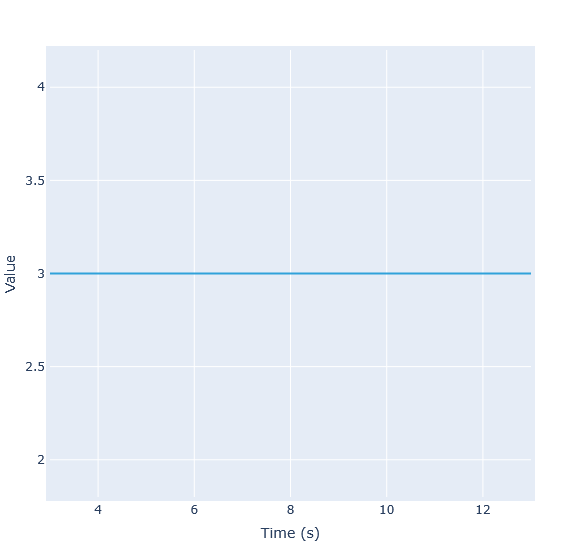

.. code-block:: yaml

    - {type: constant, value: 3, start: 3, duration: 10}

If the ``value`` is not specified, it will be set to the last value of the previous tendency. For example:

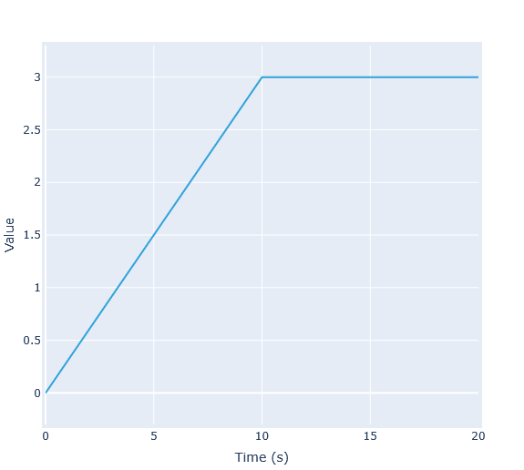

.. code-block:: yaml

    - {type: linear, to: 3, duration: 10}
    - {type: constant, duration: 10}

Linear Tendency
===============

Represents a linear change in value (increase or decrease) over the specified time interval. The line is defined by its start value, end value, and rate of change, related by ``to = from + rate * duration``.

Parameters
----------
*   ``from``: The value at the start of the tendency. If omitted, it defaults to the last value of the previous tendency (or 0 if first tendency), unless ``to`` and ``rate`` are provided.
*   ``to``: The value at the end of the tendency. If omitted, it defaults to the first value of the *next* tendency if that value is explicitly set by the user, otherwise defaults to the calculated ``from`` value (implying a rate of 0), unless ``from`` and ``rate`` are provided.
*   ``rate``: The rate of change (slope) of the signal during this tendency. If omitted, it's calculated from ``from`` and ``to``.
*   ``start``, ``duration``, ``end``: See :ref:`Common Time Parameters <available-tendencies>`.

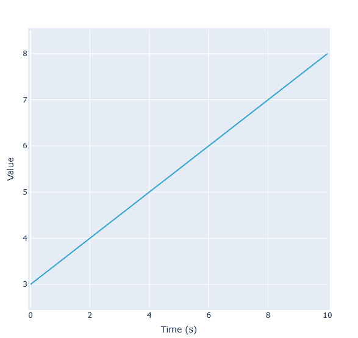

.. code-block:: yaml

    - {type: linear, from: 3, to: 8, duration: 10}

If the ``from`` or ``to`` values are not specified, they will be taken from the adjacent tendencies. For example:

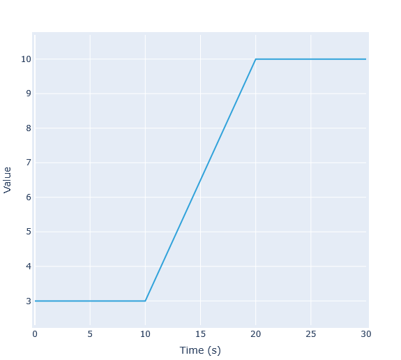

.. code-block:: yaml

    - {type: constant, value: 3, duration: 10}
    - {type: linear, duration: 10}
    - {type: constant, value: 10, duration: 10}

.. warning::
    Providing inconsistent ``from``, ``to``, and ``rate`` values (where ``from + rate * duration != to``) will result in an error. For example:

    .. code-block:: yaml

        - {type: linear, from: 3, to: 5, rate: 2, duration: 10}

Smooth Tendency
===============

Represents a smooth transition between the end of the previous tendency and the start of the next tendency using a cubic spline. This ensures that the value *and* the derivative (rate of change) are continuous at the boundaries between smooth tendencies and their neighbours.

Parameters
----------
*   ``from``: The value at the start of the tendency. If omitted, it defaults to the last value of the previous tendency (or 0 if first tendency).
*   ``to``: The value at the end of the tendency. If omitted, it defaults to the first value of the *next* tendency if that value is explicitly set by the user, otherwise defaults to the calculated ``from`` value.
*   ``start``, ``duration``, ``end``: See :ref:`Common Time Parameters <available-tendencies>`.

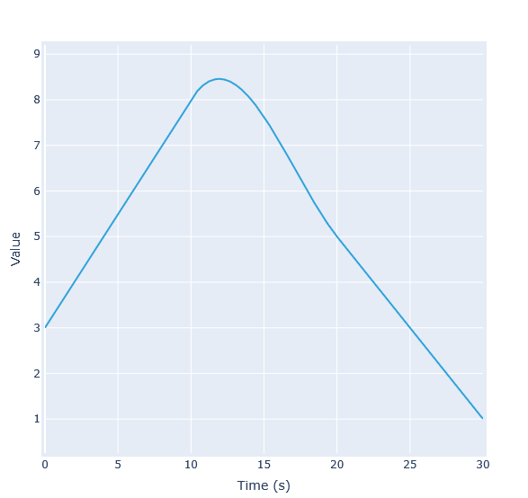

.. code-block:: yaml

    - {type: linear, from: 3, to: 8, duration: 10}
    - {type: smooth, duration: 10}
    - {type: linear, from: 5, to: 1, duration: 10}

.. note::
    The start and end derivatives are automatically set to match those of adjacent tendencies.

.. _repeat-tendency:

Repeat Tendency
===============

Repeats a defined sequence of inner tendencies (a sub-waveform) multiple times. Optionally the ``period``/``frequency`` can be provided to stretch or compress the time-axis of the waveform to match the specific frequency.

Parameters
----------
*   ``waveform``: A list defining the sequence of tendencies to be repeated. This follows the same format as the main waveform definition. The start time of the first tendency *must* be 0.
*   ``frequency``: The number of repetitions of the inner waveform per unit time. Must be positive.
*   ``period``: The duration assigned to one full repetition of the inner waveform. Must be positive.
*   ``start``, ``duration``, ``end``: See :ref:`Common Time Parameters <available-tendencies>`. These define the *total* interval over which the repetition occurs.

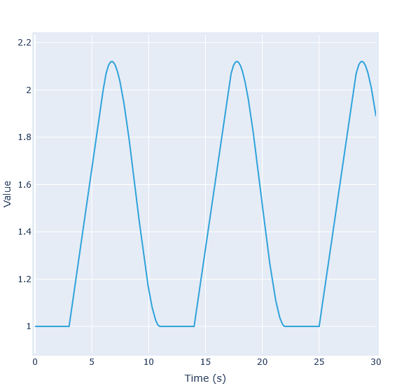

.. code-block:: yaml

    - type: repeat
      duration: 30
      waveform:
      - {type: constant, value: 1, duration: 3}
      - {type: linear, from: 1, to: 2, duration: 3}
      - {type: smooth, duration: 5}

If you want to keep the same repeated waveform as above, but would like to set the period of the repetition to be exactly 10 seconds, you can use the ``period`` or ``frequency`` parameter, for example:

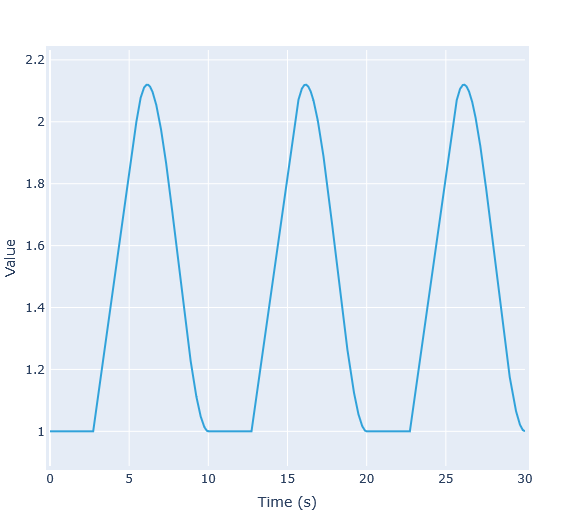

.. code-block:: yaml

    - type: repeat
      duration: 30
      period: 10
      waveform:
      - {type: constant, value: 1, duration: 3}
      - {type: linear, from: 1, to: 2, duration: 3}
      - {type: smooth, duration: 5}

.. _piecewise-linear-tendency:

Piecewise Linear Tendency
=========================

Defines a sequence of points connected by straight lines.

Parameters
----------
*   ``time``: A list of time points. Must be strictly monotonically increasing and must have at least 1 point.
*   ``value``: A list of corresponding values at each time point in the ``time`` list. Must have the same length as ``time``.

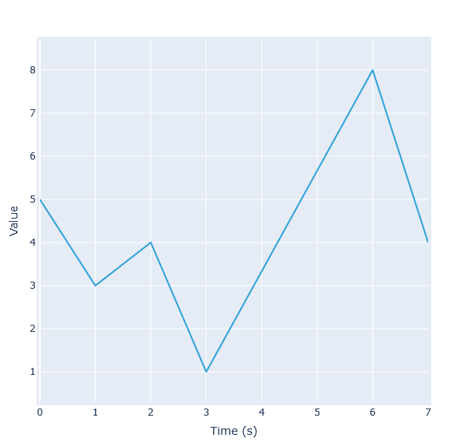

.. code-block:: yaml

    - {type: piecewise, time: [0,1,2,3,6,7], value: [5,3,4,1,8,4]}

.. warning::
    This tendency does **not** accept the common ``start``, ``duration``, or ``end`` parameters. These are derived directly from the required ``time`` list.

.. _import-tendency:

Import
======

Takes its values from an external entry in :ref:`globals.imports <global_properties>` instead of an analytic shape, resampled onto the export time base. By default it reads the waveform's own DD path.

*Type:* ``import`` (inferred when ``ref`` is present)

Parameters
----------
*   ``ref``: Entry in ``globals.imports`` to read from.
*   ``path``: DD path to read. Defaults to the waveform's own path.
*   ``time_offset``: Offset added to the export time when sampling. Defaults to ``0``.
*   ``interp``: Resampling mode: ``closest`` (default), ``linear`` or ``previous``.

.. code-block:: yaml

    core_sources/source(1)/profiles_1d/electrons/energy:
      - {ref: scenario, interp: linear}

Wildcards expand against the source: a trailing ``*`` imports a whole subtree (``<ids>/*`` copies a whole IDS), and a ``(*)`` index wildcard iterates every element of an array of structure -- several may be combined, e.g. every ion of every source. A bare ``*`` imports the whole entry: every IDS the source provides (a URI is scanned for filled IDSs; a ``{port: ...}`` source contributes the IDS it received), loading a machine description in one line. An overlay may list several sources, applied in order:

.. code-block:: yaml

    core_sources/source(*)/profiles_1d/ion(*)/z_ion:
      - {ref: scenario}

    '*':                  # whole-entry overlay; sources stack
      - {ref: machine}
      - {ref: scenario}

**Precedence.** Where imports or explicit waveforms write the same node, the most specific wins regardless of order: ``*`` < ``<ids>/*`` < subtree ``.../*`` < explicit leaf. Equal specificity falls back to listing order (last wins).

Non-0D imports (a profile, a wildcard subtree) own the whole waveform. Only **0D (scalar)** imports combine with analytic segments, each filling its ``[start, end]`` window:

.. code-block:: yaml

    equilibrium/time_slice/global_quantities/ip:
      - {type: constant, value: -1.0, duration: 1}   # analytic on [0, 1] s
      - {ref: scenario, duration: 1}                 # imported on [1, 2] s

Periodic Tendencies
===================

These tendencies represent various oscillating waveforms (Sine, Sawtooth, Triangle, Square). They share common parameters for defining the oscillation's characteristics.

Common Periodic Parameters
--------------------------

*   ``type``: The type of the oscillating waveform. Examples of each type are shown below.
*   ``frequency``: The number of cycles per unit time. Defaults to 1.0 if ``period`` is also omitted.
*   ``period``: The duration of one cycle.
*   ``base``: The baseline or center value of the oscillation (average value).
*   ``amplitude``: The amplitude of the oscillation.
*   ``min``: The minimum value reached by the oscillation.
*   ``max``: The maximum value reached by the oscillation.
*   ``phase``: The phase shift in radians. A positive phase shifts the waveform to the left. Defaults to 0. The value is wrapped to the interval [0, 2π).
*   ``start``, ``duration``, ``end``: See :ref:`Common Time Parameters <available-tendencies>`.

.. warning::
    Providing both ``frequency`` and ``period`` is invalid if ``frequency != 1 / period``. Providing more than two of ``base``, ``amplitude``, ``min``, ``max`` is also not valid.

Sine Wave
---------
A smooth oscillation following a sine function.

*Type:* ``sine``

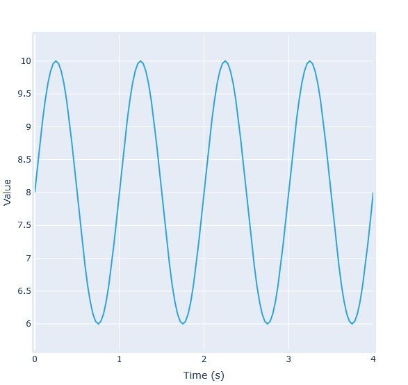

.. code-block:: yaml

    - {type: sine, base: 8, amplitude: 2, frequency: 1, duration: 4}

Sawtooth Wave
-------------
Linearly increases from minimum to maximum, then instantly drops back to minimum.

*Type:* ``sawtooth``

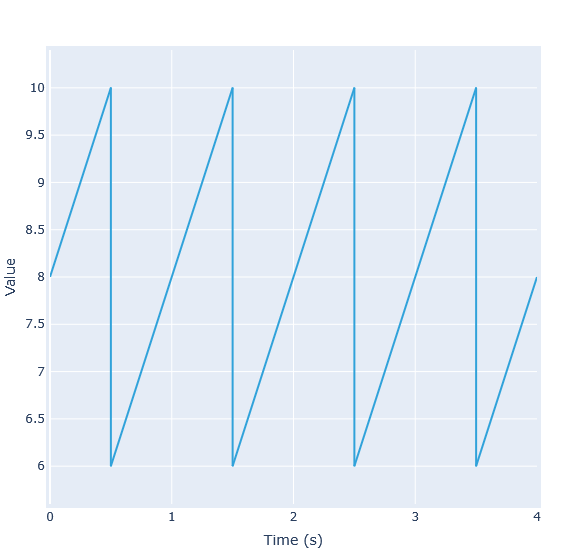

.. code-block:: yaml

    - {type: sawtooth, base: 8, amplitude: 2, frequency: 1, duration: 4}

Triangle Wave
-------------
Linearly increases from minimum to maximum, then linearly decreases back to minimum.

*Type:* ``triangle``

.. code-block:: yaml

    - {type: triangle, base: 8, amplitude: 2, frequency: 1, duration: 4}

Square Wave
-----------
Instantly switches between minimum and maximum values.

*Type:* ``square``

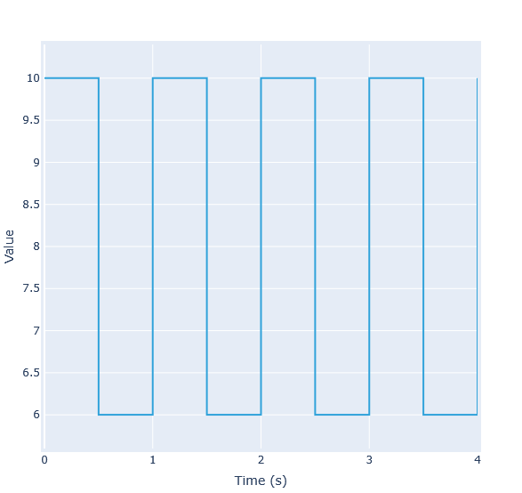

.. code-block:: yaml

    - {type: square, base: 8, amplitude: 2, frequency: 1, duration: 4}

